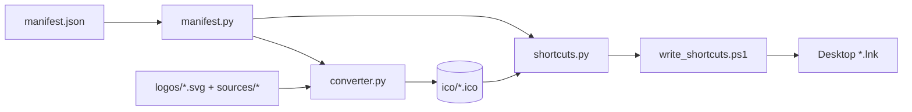

# Icon Forge

Icon Forge is a Windows developer utility that turns project logo SVGs (or PNGs) into multi-resolution ICO files and stamps them onto the VSCode quick-open shortcuts on the desktop, so every project and every category folder opens from a distinct, recognizable icon.

It exists for one concrete job: the `Desktop/VSCode Projects` folder full of
`.lnk` shortcuts that open each UVuruna project in VS Code. Left alone they all
share Windows' default icon (or random reused ones) and become impossible to
tell apart. Icon Forge renders each project's logo into a crisp ICO and points
its shortcut at it — and creates any shortcut that is missing.

---

## Table of Contents

- [What it does](#what-it-does)
- [Structure](#structure)
- [Usage](#usage)
- [How it works](#how-it-works)
- [Documentation map](#docs)

---

<a id="what-it-does"></a>

## What it does

- **Convert** — SVG or PNG → multi-resolution ICO (16–256px, supersampled +
  Lanczos for sharpness), plus an optional 512px PNG export.
- **Batch** — reads `manifest.json` and generates one ICO per project and per
  category ROOT folder.
- **Shortcuts** — creates/updates the desktop `.lnk` files: sets each one to
  open its folder in VS Code with its own generated icon. Missing shortcuts
  (projects and ROOTs) are created; existing ones are re-pointed.

The old shortcuts pointed their icons at an external `M:\` drive and several
reused the same file (Colorize SVG and Ultra Vivid were identical). Icon Forge
gives every entry a distinct icon on the always-present `U:\` drive.

<a id="structure"></a>

## Structure

```
📁 Icon Forge/
  📝 README.md              ← this file
  📝 CLAUDE.md              ← project rules (inherits monorepo root)
  ⚙️ config.py              ← paths + tunables (single source of truth)
  ⚙️ manifest.json          ← entry map (roots + projects) — tracked
  ⚙️ manifest.local.json    ← hidden entries — gitignored
  🐍 run.py                 ← CLI entry point
  📁 assets/
    🖼️ logo.svg             ← Icon Forge's own logo
  📁 core/
    📝 ___core.md
    🐍 converter.py         ← SVG/PNG → ICO/PNG engine
    🐍 manifest.py          ← load + resolve entries
    🐍 paths.py             ← path resolution
    🐍 shortcuts.py         ← .lnk writer (drives PowerShell)
    🔧 write_shortcuts.ps1  ← WScript.Shell shortcut creator
  📁 gui/
    📝 ___gui.md
    🐍 app.py               ← main window
    🐍 theme.py             ← dark theme tokens + QSS
    🐍 worker.py            ← background task thread
  📁 sources/roots/         ← category ROOT icons (SVG)
  📁 sources_local/         ← hidden-project SVGs — gitignored
  📁 ico/                   ← generated ICO output — gitignored
```

<a id="usage"></a>

## Usage

```bash
pip install -r requirements.txt

python run.py            # generate all ICOs, then sync shortcuts (default)
python run.py icons      # generate ICOs only
python run.py shortcuts  # create/update desktop shortcuts only
python run.py status     # show source / ICO / shortcut status per entry
python run.py gui        # open the GUI control panel
python run.py convert path/to/art.svg --png   # one-off convert (+512px PNG)
```

The desktop folder and VS Code path are derived from the environment; override
with the `ICON_FORGE_DESKTOP` and `ICON_FORGE_VSCODE` environment variables if
they differ on this machine (see [Config](config.md)).

<a id="how-it-works"></a>

## How it works



Sources are never duplicated: project logos are read straight from the monorepo
`logos/` folder (the single source of truth); only the category ROOT icons and
hidden-project icons live inside this tool. ICO output is computed on demand and
gitignored (root Rule #19 — compute, don't store).

<a id="docs"></a>

## Documentation map

- [Config](config.md) — paths and tunables
- [CLI Runner](run.md) — command entry point
- [Core (folder)](core/___core.md) — converter, manifest, paths, shortcuts
- [GUI (folder)](gui/___gui.md) — window, theme, worker
