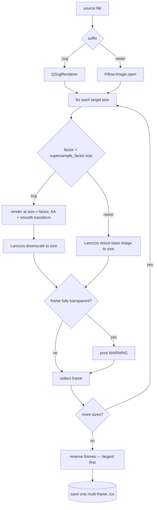

# Converter — Flow

**About:** [description](../__about/converter.md)

Earns its flow doc (root DOCS.md tier signal: "nontrivial geometry/math") —
the supersample-factor-per-size selection and the largest-first multi-frame
ICO assembly are not obvious from a single read of the code.

## Algorithm

Pseudocode (language-neutral):

    build a size -> image renderer for the source:
        IF suffix == .svg  -> QSvgRenderer (needs a live QGuiApplication)
        IF suffix in raster set -> open once with Pillow

    FOR each size in ICO_SIZES (config.py):
        factor = supersample_factor(size)   # 4x <=64px, 2x <=128px, else 1x
        IF svg:
            render at (size * factor), antialiased, smooth transform
            IF factor > 1: Lanczos-downscale render to (size, size)
        ELSE (raster):
            Lanczos-resize the already-open base image to (size, size)
        IF the frame's alpha extrema == (0, 0): warn "fully transparent"
        append frame

    reverse frame list (largest size first -- Windows shows it as primary)
    save all frames together as one multi-resolution .ico

`export_png` follows the same renderer-selection branch but stops after one
frame at `MAX_PNG` (512px, config.py) and saves it as a standalone PNG.
