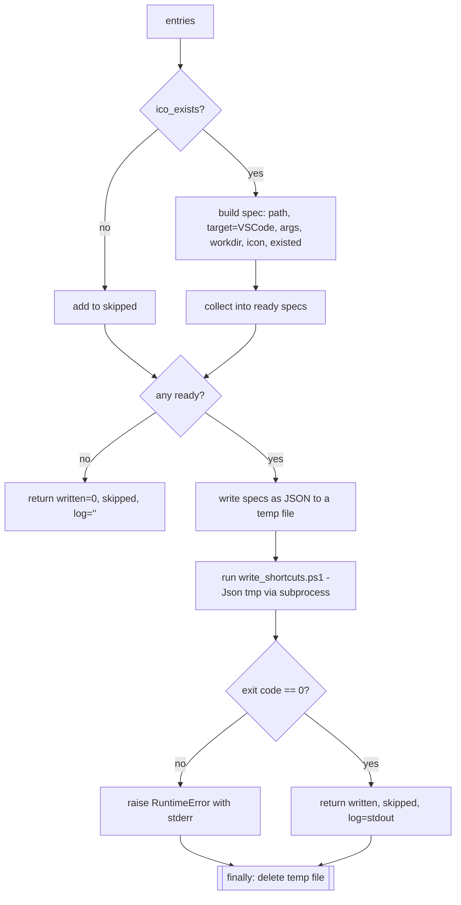

# Shortcuts — Flow

**About:** [description](../__about/shortcuts.md)

Earns its flow doc (root DOCS.md tier signals: "a process handoff" and "a
protocol with ordered steps") — the work crosses a process boundary
(Python -> temp JSON file -> PowerShell -> COM) and the ordering (skip
entries with no ICO yet, always clean up the temp file) is easy to get
wrong by re-reading only the code.

## Algorithm

Pseudocode (language-neutral):

    ready   = entries whose ICO file exists
    skipped = entries whose ICO file does not exist yet (name recorded)
    IF ready is empty: RETURN {written: 0, skipped, log: ""}

    ensure the desktop shortcut folder exists
    specs = [build_spec(e) for e in ready]     # one dict per shortcut

    write specs as JSON to a fresh temp file
    TRY:
        run write_shortcuts.ps1 (PowerShell, WScript.Shell COM) over the
        temp file's path
        IF the process exit code != 0: raise with its stderr
        RETURN {written: len(ready), skipped, log: process stdout}
    FINALLY:
        delete the temp file (always, even on raise)

`write_shortcuts.ps1` itself, per spec: ensure the shortcut's parent folder
exists, `CreateShortcut`, set TargetPath/Arguments/WorkingDirectory/
IconLocation, `Save()`, print `created`/`updated`.
