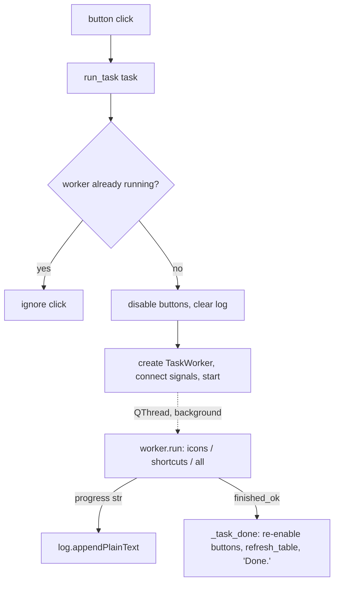

# App — Layout & Flow

**About:** [description](../__about/app.md)

Earns its flow doc (root DOCS.md tier signal: "an 86-line Qt widget is
still Algorithmic" — nature over line count) — a nontrivial multi-zone
window PLUS a real background-thread handoff (`run_task` → `TaskWorker` →
Qt signals back to the main thread) that a code read alone does not make
obvious.

## Window layout (top to bottom, `QVBoxLayout`)

```
🪟 MainWindow (760×620, dark theme)
  🟪 Header card               ← _header()
    🖼️ logo (44px SVG)
    📝 "Icon Forge" title + subtitle
  ▭ Action bar                 ← _action_bar()
    🔘 Generate + Sync (Primary, gradient)
    🔘 Generate ICOs
    🔘 Sync Shortcuts
    🔘 Convert File…
  📊 Entries table (stretch)   ← _build_table() / refresh_table()
    columns: Entry | Kind | SVG ● | ICO ● | LNK ●
  📜 Log (fixed 150px)         ← QPlainTextEdit, read-only
```

## Background task handoff



Pseudocode (language-neutral):

    ON button click(task):
        IF a worker is already running: ignore (no double-launch)
        disable all action buttons; clear the log
        create TaskWorker(task); connect its signals:
            progress(line)   -> append line to the log
            finished_ok()    -> re-enable buttons, reload the table, log "Done."
        start the worker (background QThread — the window stays responsive)
